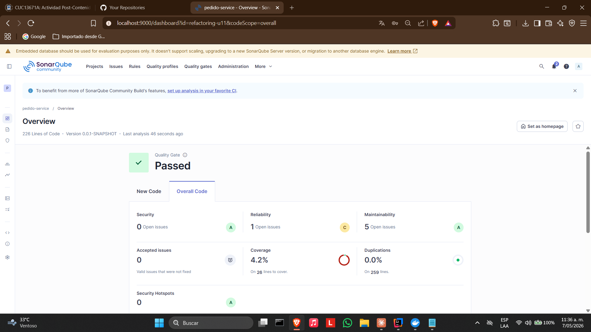
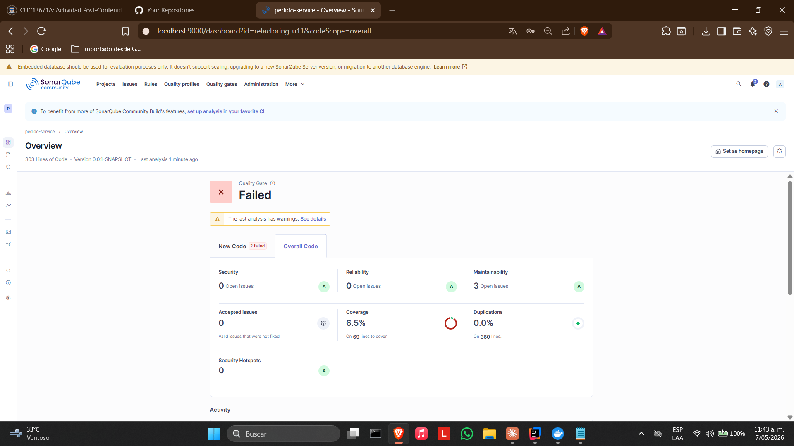

# Pedido Service — Post-Contenido 1 Unidad 11

Microservicio REST desarrollado con **Spring Boot 3** para la gestión de pedidos. Este laboratorio aplica técnicas de refactorización avanzada sobre código intencionalmente deficiente, eliminando code smells de tipo Bloater mediante Extract Method, Extract Class e introducción de Value Objects, verificando las mejoras con SonarQube.

---

## Tecnologías utilizadas

- Java 21
- Spring Boot 3
- Spring Data JPA
- H2 Database (en memoria)
- Lombok
- Maven
- JaCoCo 0.8.11
- SonarQube Community Edition (Docker)

---

## Estructura del proyecto

```
Carrillo-post1-u11/
├── src/
│   ├── main/
│   │   ├── java/com/universidad/pedidoservice/
│   │   │   ├── domain/
│   │   │   │   ├── Pedido.java
│   │   │   │   ├── Producto.java
│   │   │   │   ├── DatosCliente.java       # Value Object
│   │   │   │   ├── Direccion.java          # Value Object
│   │   │   │   ├── CodigoDescuento.java    # Value Object
│   │   │   │   └── LineaPedido.java        # Value Object
│   │   │   ├── repository/
│   │   │   │   └── PedidoRepository.java
│   │   │   └── service/
│   │   │       ├── PedidoService.java
│   │   │       └── NotificacionService.java  # Extract Class
│   │   └── resources/
│   │       └── application.properties
│   └── test/
├── pom.xml
└── README.md
```

---

## Cómo ejecutar el proyecto

### 1. Compilar y ejecutar pruebas

```bash
mvn clean verify
```

### 2. Levantar SonarQube con Docker

```bash
docker start sonarqube
```

Acceder en: [http://localhost:9000](http://localhost:9000)

### 3. Ejecutar análisis de SonarQube

```bash
mvn verify sonar:sonar -Dsonar.host.url=http://localhost:9000 -Dsonar.token=TU_TOKEN -Dsonar.projectKey=refactoring-u11
```

---

## Code Smells identificados en el código original

### 1. Long Method — `procesarPedido()`
El método concentraba validación del cliente, cálculo de totales, aplicación de descuentos, notificación y persistencia en un solo bloque de más de 30 líneas. Complejidad ciclomática alta por las múltiples ramas condicionales.

### 2. Primitive Obsession / Data Clump
El método recibía 12 parámetros primitivos (`clienteNombre`, `clienteEmail`, `clienteTelefono`, `clienteDireccion`, `clienteCiudad`, `clienteCodigoPostal`) que representaban conceptos de negocio relacionados pero dispersos como strings independientes.

### 3. Large Class / Violación de SRP
`PedidoService` manejaba simultáneamente lógica de negocio, cálculos financieros y notificaciones al cliente, violando el Principio de Responsabilidad Única.

### 4. Inyección por campo con `@Autowired`
El repositorio se inyectaba directamente en el campo, dificultando las pruebas unitarias y ocultando las dependencias reales de la clase.

---

## Técnicas de refactorización aplicadas

### Extract Method
Se dividió `procesarPedido()` en métodos privados con responsabilidad única:
- `calcularTotal(LineaPedido[] lineas)` — suma los totales de cada línea
- `aplicarDescuento(double total, CodigoDescuento descuento)` — aplica el porcentaje correspondiente
- `persistirPedido(Long clienteId, DatosCliente cliente, double total)` — crea y guarda el pedido

El método principal quedó reducido a 4 líneas de orquestación con CC = 1.

### Extract Class
La lógica de notificación al cliente se extrajo a `NotificacionService`, una clase independiente inyectada por constructor en `PedidoService`. Esto separa claramente las responsabilidades y permite modificar o reemplazar la lógica de notificación sin tocar el servicio de pedidos.

### Introducción de Value Objects
Se crearon cuatro Value Objects inmutables para eliminar la Primitive Obsession:

| Value Object | Responsabilidad |
|---|---|
| `DatosCliente` | Agrupa nombre, email, teléfono y dirección del cliente con validaciones propias |
| `Direccion` | Encapsula calle, ciudad y código postal con validación de campos requeridos |
| `CodigoDescuento` | Encapsula el código y su porcentaje asociado mediante factory method |
| `LineaPedido` | Representa una línea de pedido con precio unitario y cantidad |

### Inyección por constructor
Se eliminó `@Autowired` en campo y se reemplazó por inyección por constructor en `PedidoService`, haciendo las dependencias explícitas y facilitando las pruebas unitarias.

---

## Comparativa de métricas SonarQube antes y después

| Métrica | Análisis Inicial | Análisis Final | Cambio |
|---|---|---|---|
| Security | A (0 issues) | A (0 issues) | ✅ Sin cambio |
| Reliability | C (1 issue) | A (0 issues) | ✅ Mejoró |
| Maintainability | A (5 issues) | A (3 issues) | ✅ Mejoró |
| Coverage | 4.2% | 6.5% | ✅ Mejoró |
| Duplications | 0.0% | 0.0% | ✅ Sin cambio |
| Lines of Code | 226 | 303 | Aumentó por clases nuevas |

> El aumento en líneas de código es esperado y positivo: refleja la correcta separación de responsabilidades en múltiples clases pequeñas y cohesivas, en lugar de un único método largo.

---

## Endpoints disponibles

| Método | URL | Descripción |
|---|---|---|
| GET | `/api/pedidos` | Lista todos los pedidos |
| GET | `/api/pedidos/{id}` | Busca un pedido por ID |

---

## Santiago Carrillo

Laboratorio Post-Contenido 1 — Unidad 11: Refactorización Avanzada y Clean Code Profundo
Ingeniería de Sistemas — Universidad de Santander (UDES) — 2026

Primer Análisis con Code Smells Intencionales


Segundo Analisis refactorizado

El Quality Gate muestra Failed porque este proyecto heredó el Quality Gate "Estándar Universidad" del laboratorio anterior que exige 60% de cobertura. No es un problema real del código, es la configuración del gate.
