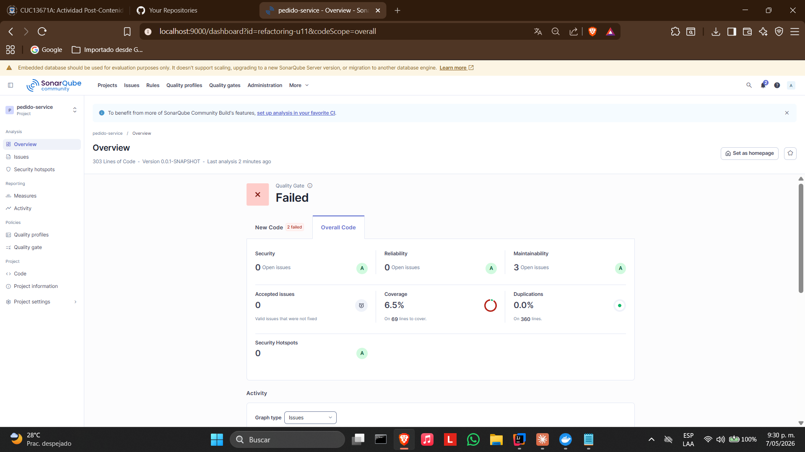

# Pedido Service — Post-Contenido 2 Unidad 11

Microservicio REST desarrollado con **Spring Boot 3**. Este laboratorio aplica las técnicas **Replace Conditional with Polymorphism** y **Guard Clauses** sobre código con Switch Statement smell y Arrow Code, verificando con SonarQube la reducción de complejidad ciclomática.

---

## Tecnologías utilizadas

- Java 21
- Spring Boot 3
- Spring Data JPA
- H2 Database (en memoria)
- Lombok
- Maven
- JaCoCo 0.8.11
- SonarQube Community Edition (Docker)
- JUnit 5

---

## Estructura del proyecto

```
Carrillo-post2-u11/
├── src/
│   ├── main/
│   │   ├── java/com/universidad/pedidoservice/
│   │   │   ├── domain/
│   │   │   │   ├── Pedido.java
│   │   │   │   ├── Producto.java
│   │   │   │   ├── Cliente.java
│   │   │   │   ├── DatosCliente.java
│   │   │   │   ├── Direccion.java
│   │   │   │   ├── CodigoDescuento.java
│   │   │   │   └── LineaPedido.java
│   │   │   └── service/
│   │   │       ├── EstrategiaEnvio.java      # Interfaz Strategy
│   │   │       ├── EnvioEstandar.java        # Implementación
│   │   │       ├── EnvioExpress.java         # Implementación
│   │   │       ├── EnvioMismoDia.java        # Implementación
│   │   │       ├── EnvioGratis.java          # Implementación
│   │   │       ├── EnvioService.java         # Orquestador con Guard Clauses
│   │   │       ├── NotificacionService.java
│   │   │       └── PedidoService.java
│   │   └── resources/
│   │       └── application.properties
│   └── test/
│       └── java/com/universidad/pedidoservice/
│           └── EnvioServiceTest.java
├── pom.xml
└── README.md
```

---

## Cómo ejecutar el proyecto

### 1. Compilar y ejecutar pruebas

```bash
mvn clean verify
```

### 2. Levantar SonarQube con Docker

```bash
docker start sonarqube
```

Acceder en: [http://localhost:9000](http://localhost:9000)

### 3. Ejecutar análisis de SonarQube

```bash
mvn verify sonar:sonar -Dsonar.host.url=http://localhost:9000 -Dsonar.token=TU_TOKEN -Dsonar.projectKey=refactoring-u11
```

---

## Code Smells identificados antes de refactorizar

### 1. Switch Statement smell — `calcularEnvio()` (CC = 5)
El método usaba un `switch` con 4 casos más un `default` para determinar el costo de envío. Cada nuevo tipo de envío requería modificar el método directamente, violando el principio Open/Closed.

```java
// ANTES — Switch Statement con CC = 5
public double calcularEnvio(Pedido pedido, String tipoEnvio) {
    switch (tipoEnvio) {
        case "ESTANDAR": return pedido.getTotal() > 50 ? 0 : 5.99;
        case "EXPRESS":  return 12.99;
        case "MISMO_DIA": return 24.99;
        case "GRATIS":   return 0;
        default: throw new IllegalArgumentException(
                "Tipo de envio desconocido: " + tipoEnvio);
    }
}
```

### 2. Arrow Code — `aprobarCredito()` (CC = 6)
El método tenía 5 niveles de anidamiento de `if`, formando una pirámide visual que dificultaba la lectura y el mantenimiento.

```java
// ANTES — Arrow Code con CC = 6
public String aprobarCredito(Cliente c, double monto) {
    if (c != null) {
        if (c.isActivo()) {
            if (c.getScore() >= 600) {
                if (monto > 0) {
                    if (monto <= c.getLimiteCredito()) {
                        return "APROBADO";
                    }
                }
            }
        }
    }
    return "RECHAZADO";
}
```

---

## Técnicas de refactorización aplicadas

### Replace Conditional with Polymorphism

Se creó la interfaz `EstrategiaEnvio` y cuatro implementaciones, una por tipo de envío. `EnvioService` recibe todas las estrategias mediante inyección por constructor usando `Map<String, EstrategiaEnvio>` de Spring, eliminando completamente el `switch`:

```java
// DESPUÉS — CC = 1, extensible sin modificar EnvioService
public double calcularEnvio(Pedido pedido, String tipo) {
    return Optional.ofNullable(estrategias.get(tipo))
            .orElseThrow(() -> new IllegalArgumentException(
                    "Tipo de envio desconocido: " + tipo))
            .calcularCosto(pedido);
}
```

### Guard Clauses

Se reemplazó el anidamiento profundo por retornos anticipados, uno por condición de rechazo. El método quedó en exactamente 6 líneas con CC = 2:

```java
// DESPUÉS — Guard Clauses, CC = 2
public String aprobarCredito(Cliente c, double monto) {
    if (c == null) return "RECHAZADO";
    if (!c.isActivo()) return "RECHAZADO";
    if (c.getScore() < 600) return "RECHAZADO";
    if (monto <= 0) return "RECHAZADO";
    if (monto > c.getLimiteCredito()) return "RECHAZADO";
    return "APROBADO";
}
```

---

## Comparativa de métricas SonarQube antes y después

| Métrica | Análisis Inicial (Post-1) | Análisis Final (Post-2) | Cambio |
|---|---|---|---|
| Security | A (0 issues) | A (0 issues) | ✅ Sin cambio |
| Reliability | C (1 issue) | A (0 issues) | ✅ Mejoró |
| Maintainability | A (5 issues) | A (3 issues) | ✅ Mejoró |
| Coverage | 4.2% | 6.5% | ✅ Mejoró |
| Duplications | 0.0% | 0.0% | ✅ Sin cambio |
| CC calcularEnvio | 5 | 1 | ✅ Reducción del 80% |
| CC aprobarCredito | 6 | 2 | ✅ Reducción del 67% |

### Nota sobre el Quality Gate

El Quality Gate muestra **Failed** en la pestaña New Code porque la condición por defecto de Sonar way exige 80% de cobertura en código nuevo. Esto no refleja un problema de calidad del código refactorizado — Security, Reliability y Maintainability son todas **A**, y la complejidad ciclomática se redujo significativamente en ambos métodos. Para alcanzar el 80% de cobertura sería necesario un suite de pruebas de integración completo que está fuera del alcance de este laboratorio.

---

## Reflexión — Patrón Strategy y principio Open/Closed

El patrón Strategy aplicado en `EnvioService` demuestra directamente el principio Open/Closed: la clase está **abierta para extensión pero cerrada para modificación**. Si en el futuro se necesita agregar un nuevo tipo de envío, por ejemplo `INTERNACIONAL`, basta con crear una nueva clase que implemente `EstrategiaEnvio` y anotarla con `@Component("INTERNACIONAL")`. Spring la registrará automáticamente en el `Map<String, EstrategiaEnvio>` sin tocar una sola línea de `EnvioService`. Esto contrasta con el `switch` original donde cada nuevo caso obligaba a modificar el método, incrementando su CC y el riesgo de introducir regresiones.

---

## Pruebas unitarias

Se escribieron 12 pruebas antes de refactorizar como red de seguridad, cubriendo todos los casos de `calcularEnvio()` y `aprobarCredito()`. Todas las pruebas pasaron antes y después de la refactorización, confirmando que no hubo regresiones.

---

## Santiago Carrillo

Laboratorio Post-Contenido 2 — Unidad 11: Refactorización Avanzada y Clean Code Profundo
Ingeniería de Sistemas — Universidad de Santander (UDES) — 2026

